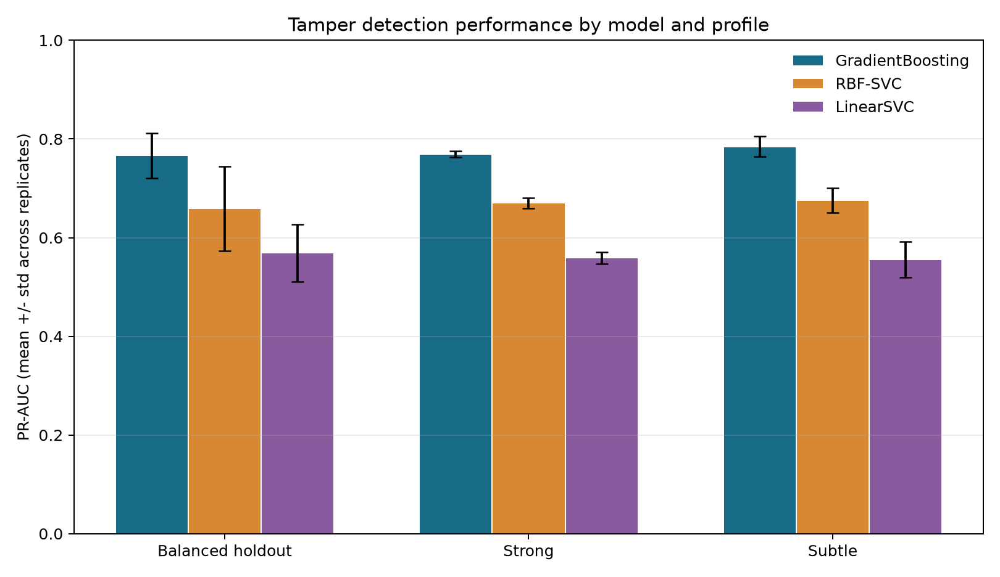
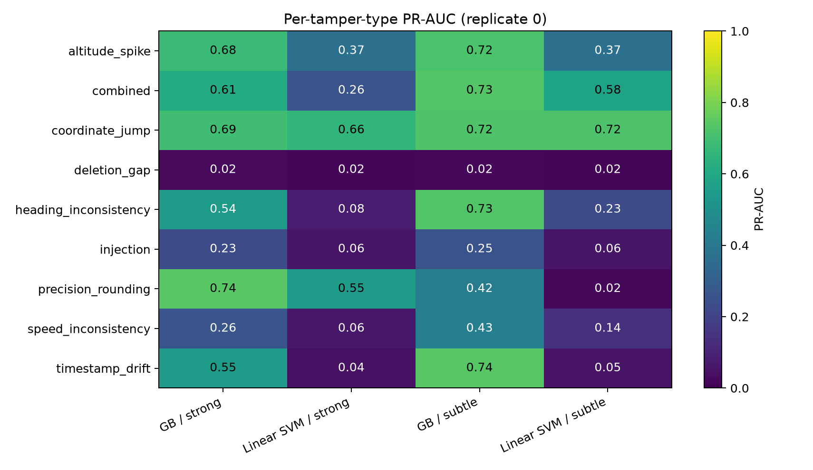
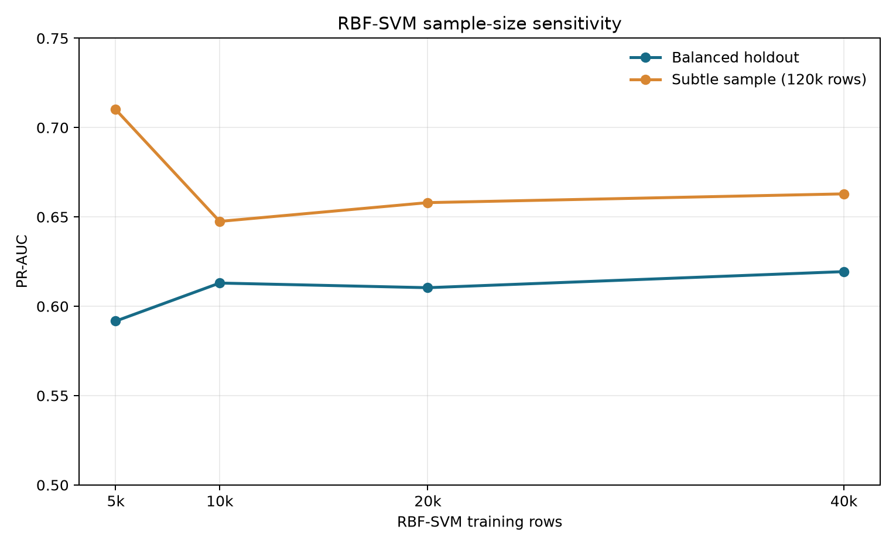

# Comparison of Gradient Boosting and Support Vector Machine for Drone Flight-Log Tamper Detection

**Dataset:** Drone Telemetry Tampering Dataset v2 (Kaggle, CC BY-SA 4.0, synthetically generated)
**Reproducible via:** `uv` + `scripts/run_pipeline.py` (plain Python, no notebook)
**Date:** 2026-08-21

---

## Abstract

We compare supervised classifiers for detecting tampered rows in UAV (drone) flight-log
telemetry: **Gradient Boosting** (`HistGradientBoostingClassifier`), a tree-based approach
that reaches a decision through a sequence of self-correcting decision trees, and a
**Support Vector Machine**, a margin-based approach that finds the boundary best
separating genuine from tampered logs, in both its **linear** (`LinearSVC`, all training
rows) and **nonlinear RBF** (`SVC(kernel='rbf')`, deterministic 20,000-row sample) forms.
All models are trained on the same temporal/kinematic feature set and the same case-level
80/20 split of the `balanced` profile, then evaluated on untouched `strong` and `subtle`
magnitude profiles across all four replicates. Gradient Boosting consistently outperforms
both SVMs at the row level (subtle PR-AUC 0.785 ± 0.020 vs 0.556 ± 0.037 for linear SVM
and 0.675 ± 0.025 for RBF SVM across replicates) and at the case level, where it flags
100% of tampered flight cases while the linear SVM misses entire tampering classes
(and the RBF SVM misses some). Nonlinearity helps the SVM substantially but does not close
the gap. Neither SVM-based model detects `deletion_gap` tampering at the row level
(recall ≈ 2%), because deleted rows leave almost no trace in the surviving telemetry.

## 1. Introduction and research question

Flight-log integrity is a prerequisite for UAV forensics, incident analysis, and
airspace-compliance investigation. Telemetry logs record timestamped position and motion
fields, and an attacker can alter them. This study answers the question:

> For row-level tamper detection in drone telemetry, does a self-correcting ensemble of
> decision trees (Gradient Boosting) outperform a margin-based Support Vector Machine —
> in both linear and nonlinear (RBF) variants — and how does the gap depend on tampering
> magnitude (`balanced` / `strong` / `subtle`) and tampering technique?

## 2. Dataset

The archive contains three **profiles** — `balanced` (magnitude 1.0), `strong`
(magnitude 1.35), and `subtle` (magnitude 0.65) — each with four **replicates**
(`rep_00`–`rep_03`) of 60 flight cases. Every case was generated from the same decoded
source flight log, so the profiles differ in the *magnitude* of the injected anomalies,
not in the underlying flight. Each row carries 15 columns including `case_id`, `row_idx`,
`label` (0 = normal, 1 = tampered), `tamper_type`, `timestamp`, `latitude`, `longitude`,
`altitude`, `speed`, `heading`, `source`, and `original_row_idx`.

### 2.1 Audit findings (replicate 0)

| Profile | Rows | Cases | Row anomaly rate |
|---|---|---|---|
| balanced | 697,640 | 60 | 27.3% |
| strong | 694,786 | 60 | 28.2% |
| subtle | 705,587 | 60 | 30.0% |

- No missing values; no exact duplicate rows; ~0.5% of rows duplicate telemetry when row
  indices are ignored (interpreted as stationary-flight records and retained).
- `tamper_type == 'normal'` iff `label == 0` — a clean, one-to-one label semantics.
- Case-level: 55/60 balanced cases contain at least one tampered segment; case-level
  "contains any anomaly" is therefore imbalanced toward tampered.
- A sentinel `1970-01-01` row is the first row of every case. It is **not always benign**:
  in 8/60 balanced cases the sentinel row itself is tampered (`label=1`). Sentinel rows
  are therefore retained; the first row of each case is simply given no temporal
  predecessor, and the artificial ~54-year gap is clipped.
- ~1.5–1.8% of intra-case timestamp deltas are negative (a tamper-related signal) and are
  captured by features rather than dropped.
- The measured row anomaly rate (~27–30%) exceeds the 14% `anom_rate_target` reported in
  the dataset metadata.

## 3. Experimental design

### 3.1 Case-level data splitting

Telemetry rows within a flight case are highly correlated, so **rows are never split
individually**. All splits are performed on the composite group `(replicate, case_id)`.

Per replicate:

| Dataset | Cases | Role |
|---|---:|---|
| balanced | 60 → **48 train / 12 holdout** | Development (80/20, stratified by case tamper status) |
| strong | 60 | Untouched external test |
| subtle | 60 | Untouched external test |

The split is stratified by `case_label = max(row label)` so the holdout preserves the
distribution of fully-normal vs tampered cases. `random_state = 42` throughout.

### 3.2 Feature engineering

Each flight sequence is converted into 25 per-row **temporal and kinematic features**,
computed strictly **within each case** (grouped by `case_id`):

- temporal: `dt_s` (clipped to 3600 s), `ts_gap_flag` (`dt > 60 s`)
- kinematic: `d_lat_deg`, `d_lon_deg`, `dist_m` (haversine), `d_alt_m`, `speed_gps_mps`
  (GPS-derived), `speed_resid_mps` (recorded − GPS speed), `accel_mps2`,
  `alt_rate_mps`, circular `d_heading_deg`
- positional/context: `row_frac` (relative position in case)
- local context: rolling (window 10) deviation and rolling std for `altitude`, `speed`,
  `latitude`, `longitude`
- raw telemetry: `altitude`, `speed`, `heading`, `latitude`, `longitude`

Leakage-bearing columns are excluded: `label`, `tamper_type`, `case_name`, `profile`,
`replicate`, `case_id`, `row_idx`, `source`, `original_row_idx`, and the raw `timestamp`.

### 3.3 Models

- **Gradient Boosting:** `HistGradientBoostingClassifier` (max_iter=300, lr=0.1,
  max_leaf_nodes=31, min_samples_leaf=20, early stopping). NaN-safe by construction; class
  imbalance handled with balanced training sample weights.
- **Support Vector Machine (linear):** `Pipeline(SimpleImputer(median) → StandardScaler →
  LinearSVC(class_weight='balanced', dual='auto'))`. Uses **all** training rows; a linear
  kernel is required for scalability to ~560k rows.
- **Support Vector Machine (nonlinear):** `SVC(kernel='rbf', C=1.0, gamma='scale',
  class_weight='balanced')` in the same pipeline. RBF SVC is not tractable on all training
  rows, so it is trained on a deterministic, **label-stratified 20,000-row sample** of the
  balanced training set (`random_state=42`), preserving class balance.

All three models see the **same features** and the same balanced training-case pool.
`Strong`/
`subtle` are never used for fitting, scaling, sampling, or threshold selection.

### 3.4 Evaluation protocol

- **Scores:** Gradient Boosting uses `predict_proba[:, 1]`; the SVM uses
  `decision_function`. Both are monotone anomaly scores, valid for threshold-free metrics.
- **Thresholds:** a per-model threshold is tuned on the balanced holdout to maximize F1 and
  then applied **unchanged** to `strong` and `subtle`.
- **Row-level metrics:** PR-AUC (primary, due to class imbalance), ROC-AUC, precision,
  recall, F1, balanced accuracy, MCC.
- **Case-level metrics:** row scores aggregated per case via `max`, case label via `max`
  (case contains any tampering).
- **Robustness:** the entire protocol is repeated identically on `rep_00`–`rep_03`;
  results are reported as mean ± std.
- **RBF SVM:** thresholds tuned on each replicate's balanced holdout; training-sample size
  and wall-clock fit time are recorded.

## 4. Results

### 4.1 Row-level, replicate 0 (rep_00)

| Dataset | Model | PR-AUC | ROC-AUC | F1 | Precision | Recall | Bal. acc. | MCC |
|---|---|---|---|---|---|---|---|---|
| Balanced holdout | Gradient Boosting | **0.701** | 0.806 | 0.617 | 0.801 | 0.501 | 0.734 | 0.565 |
| Balanced holdout | LinearSVC | 0.567 | 0.715 | 0.499 | 0.618 | 0.418 | 0.675 | 0.409 |
| Strong | Gradient Boosting | **0.778** | 0.833 | 0.694 | 0.850 | 0.587 | 0.773 | 0.621 |
| Strong | LinearSVC | 0.554 | 0.688 | 0.483 | 0.588 | 0.409 | 0.648 | 0.336 |
| Subtle | Gradient Boosting | **0.778** | 0.818 | 0.657 | 0.877 | 0.525 | 0.747 | 0.590 |
| Subtle | LinearSVC | 0.535 | 0.640 | 0.363 | 0.710 | 0.244 | 0.601 | 0.304 |

Gradient Boosting outperforms the linear SVM on **every** dataset and **every** metric. The
gap is largest on the hardest (subtle) profile, where the SVM's F1 drops to 0.363.

### 4.2 Case-level, replicate 0

Aggregating row scores to `max` per flight case, with thresholds tuned on the holdout:

| Dataset | Model | F1 | Precision | Recall |
|---|---|---|---|---|
| Strong | Gradient Boosting | **1.000** | 1.000 | 1.000 |
| Strong | LinearSVC | 0.872 | 1.000 | 0.774 |
| Subtle | Gradient Boosting | **1.000** | 1.000 | 1.000 |
| Subtle | LinearSVC | 0.575 | 1.000 | 0.404 |

Gradient Boosting flags **every** tampered case (and no normal case). The SVM misses ~23%
of strong and ~60% of subtle tampered cases. Note the small case counts (60 per profile,
3–7 normal cases) make case-level metrics illustrative rather than statistically stable.

### 4.3 Per-tamper-type breakdown (rep_00, row level)

PR-AUC of each tamper type against normal telemetry, using the fixed holdout thresholds:

| Tamper type | GB PR-AUC strong / subtle | SVM PR-AUC strong / subtle |
|---|---|---|
| altitude_spike | .68 / .72 | .37 / .37 |
| coordinate_jump | .69 / .72 | .66 / .72 |
| timestamp_drift | .55 / .74 | .04 / .05 |
| heading_inconsistency | .54 / .73 | .08 / .23 |
| precision_rounding | .74 / .42 | .55 / .02 |
| injection | .23 / .25 | .06 / .06 |
| speed_inconsistency | .26 / .43 | .06 / .14 |
| combined | .61 / .73 | .26 / .58 |
| **deletion_gap** | **.02 / .02** | **.02 / .02** |

Findings:

- **Both models fail on `deletion_gap`** (row recall ≈ 2%). Deletion removes rows, so the
  surviving telemetry looks normal; only the gap boundary is anomalous. At the case level,
  Gradient Boosting still catches all deletion-gap cases (via the boundary), while the SVM
  misses ~1/3 of them on subtle.
- **The SVM collapses on `timestamp_drift`, `heading_inconsistency`, and subtle
  `precision_rounding`** — patterns that a linear boundary cannot separate. Gradient
  Boosting remains robust (PR-AUC ≈ 0.55–0.74) on all of them.
- **Injection** is hard for both (GB PR-AUC ≈ 0.23–0.25) — injected rows resemble genuine
  rows.
- **Normal false-positive rate:** Gradient Boosting ~3–4% vs SVM ~4–11%.

### 4.4 Robustness across replicates (rep_00–rep_03)

The identical protocol was applied to all four replicates. Row-level PR-AUC, mean ± std:

| Dataset | Gradient Boosting | LinearSVC |
|---|---|---|
| Balanced holdout | 0.767 ± 0.046 | 0.569 ± 0.058 |
| Strong | 0.770 ± 0.006 | 0.559 ± 0.012 |
| Subtle | 0.785 ± 0.020 | 0.556 ± 0.037 |

Variance is low (especially on the external tests), and the ordering is stable across every
replicate, confirming the conclusion is not an artifact of one synthetic arrangement.
Replicate 0 reproduces exactly (subtle GB PR-AUC 0.778 in both the single-run and the
robustness pass), confirming the pipeline is deterministic.

### 4.5 Nonlinear (RBF) SVM sensitivity

The RBF-kernel SVM (trained on a deterministic 20,000-row stratified sample) sits **between**
the linear SVM and Gradient Boosting on every dataset and every replicate:

| Dataset | Gradient Boosting | LinearSVC | RBF-SVC |
|---|---|---|---|
| Balanced holdout | 0.767 ± 0.046 | 0.569 ± 0.058 | 0.659 ± 0.086 |
| Strong | 0.770 ± 0.006 | 0.559 ± 0.012 | 0.670 ± 0.010 |
| Subtle | **0.785 ± 0.020** | 0.556 ± 0.037 | **0.675 ± 0.025** |

Row-level subtle PR-AUC per replicate:

| Replicate | Gradient Boosting | LinearSVC | RBF-SVC |
|---|---|---|---:|
| 0 | 0.778 | 0.535 | 0.658 |
| 1 | 0.760 | 0.555 | 0.666 |
| 2 | 0.785 | 0.518 | 0.658 |
| 3 | 0.816 | 0.615 | 0.718 |

The nonlinear kernel recovers a large part of the SVM's deficit (+0.12 PR-AUC over
`LinearSVC` on subtle) but does **not** reach Gradient Boosting. RBF fit time was ≈ 4.4 s
per replicate on the 20,000-row sample.

### 4.6 RBF learning curve

To validate that 20,000 rows is a defensible sample size, the identical RBF protocol was
run on `rep_00` at 5k / 10k / 20k / 40k rows. The curve is evaluated on the balanced
holdout and a deterministic 120k-row sample of `subtle` (full 700k-row RBF scoring is
prohibitively slow for a multi-point curve):

| Sample size | PR-AUC (holdout) | PR-AUC (subtle 120k) |
|---|---|---:|
| 5,000 | 0.592 | 0.710 |
| 10,000 | 0.613 | 0.648 |
| 20,000 | 0.610 | 0.658 |
| 40,000 | 0.619 | 0.663 |

Performance plateaus by ~10–20k rows; increasing to 40k adds only +0.005 PR-AUC on subtle
and +0.009 on holdout. The 20k subtle value (0.658) matches the full-subtle result in
§4.5 (0.658), confirming the probe is representative. **20,000 rows is therefore a
reasonable plateau point** for the RBF comparison.

### 4.7 Figures







## 5. Discussion

- **Tree-based vs margin-based.** The gradient-boosting ensemble learns disjoint local
  conditions (e.g., "speed residual large *and* heading changed"), which matches how
  tampering manifests as a violation of kinematic consistency. The linear SVM can only
  separate classes along a single hyperplane, so it fails whenever the anomalous region is
  not linearly separable from normal telemetry in the engineered feature space
  (timestamp drift, heading inconsistency, subtle precision rounding).
- **Nonlinearity helps but is not enough.** The RBF kernel recovers much of the linear
  SVM's deficit (+0.12 PR-AUC on subtle), confirming that part of the gap is due to
  linearity. But Gradient Boosting still wins on every dataset and replicate, and it does
  so while using **all** training rows (565k) rather than a 20k sample. The remaining gap
  reflects the ensemble's ability to model many disjoint anomalous regimes that a single
  global kernel boundary cannot capture, plus the sample-size handicap of the RBF fit.
- **The failure on `deletion_gap` is structural, not a model deficiency.** It reflects the
  information-theoretic difficulty of the task: after rows are removed, the remaining
  telemetry is consistent. Case-level aggregation partially recovers it because the gap
  boundary is anomalous.
- **Case-level detection is essentially solved for Gradient Boosting** (F1 = 1.0 on
  strong/subtle), but the number of cases is small; the comparative evidence is therefore
  strongest at the row level.

## 6. Limitations

- All cases are generated from a **single source flight log**. The `strong`/`subtle`
  evaluation measures generalization across tampering **magnitude**, not across new
  flights, flight regimes, or sensor hardware.
- The data is **synthetic**; real telemetry may contain different noise and fault
  distributions.
- Row labels are strongly autocorrelated within cases; although splitting is case-level,
  the *effective* independent sample size is smaller than the row count.
- Case-level numbers are based on 60 cases per profile and 3–7 normal cases, so they are
  not statistically stable.
- The RBF SVM is trained on a **20,000-row sample** (the full set is intractable), so its
  comparison against models using all rows is not perfectly apples-to-apples; a larger
  sample would be a more favorable setting for the RBF kernel. Hyperparameters
  (`C`, `gamma`) are fixed, not tuned.
- The model is **not validated on real flight logs**; an external check on three real
  logs is reported in §6.1 and shows that it does not transfer in its current form.

### 6.1 External check on real flight logs

Three real flight logs (DJI Matrice 4D and M3D, per the logs' own `DroneType` field;
1,107 records in total) were scored as an external check. They carry **no tamper labels**,
so no accuracy metric can be computed and none is reported here — the check is qualitative.
Flag rates alone cannot distinguish "detected tampering" from "mis-fired on clean data",
so the rate while the aircraft is stationary on the ground is reported alongside, as a
record where tampering is implausible:

| Detector | Records flagged | Flagged while stationary |
|---|---|---|
| Gradient Boosting (main model) | 98.0–99.8% | **98.6–100%** |
| Gradient Boosting (transfer variant) | 13.2–56.7% | 9.9–20.3% |
| Pooled cross-flight baseline | 37.8–47.5% | 23.2–49.2% |

The main model flags almost every record, including essentially every record in which the
aircraft is stationary at zero recorded speed. This indicates the model is mis-firing on
out-of-distribution input rather than detecting manipulation.

Two distribution shifts account for it. The synthetic training data is sampled at ~0.1 s
intervals against 2.0 s in the real logs — a twenty-fold difference that shifts every
time-derived feature — and the source flight lies near 8°N, 98°E while the real flights
lie between 24°N and 37°N, with absolute latitude and longitude used as model inputs.
Every real record therefore falls outside the region of feature space the model was fitted
on.

A transfer variant (`scripts/train_transfer_model.py`), trained on synthetic data thinned
to a 2 s interval and with absolute position and heading features removed, reduces the
stationary flag rate to 9.9–20.3%, supporting that diagnosis. Its synthetic PR-AUC falls
correspondingly (0.51–0.58 against 0.77), reflecting the loss of both training rows and
features.

Labelling real logs is not possible from the logs alone: they contain no ground truth and
no verifiable integrity signature. Establishing one would require injecting known
tampering into authentic flights to produce semi-synthetic labelled data, which is left to
future work. With only three flights available, such an evaluation would also be limited
to leave-one-flight-out cross-validation and would carry little statistical power.

Rates above are reproducible via `scripts/summarise_real_logs.py`, which writes
`results/real_log_summary.csv` from the per-detector outputs in `results/scored/`.

## 7. Conclusion

For this dataset, **Gradient Boosting is the better detector**: it is more accurate at the
row level across all profiles and replicates (subtle PR-AUC 0.785 vs 0.556 for linear SVM
and 0.675 for RBF SVM), detects every tampered flight case where the SVMs miss entire
tampering classes, and has a lower false-positive rate on genuine telemetry. The
margin-based approach is brittle on subtle, non-linearly-separable tampering patterns;
making the kernel nonlinear (RBF) recovers only part of the deficit. All models leave
`deletion_gap` undetected at the row level. If an SVM must be used, the RBF kernel is the
better choice than a linear one, but Gradient Boosting offers the best accuracy with
better scalability.

This conclusion is scoped to the synthetic dataset. An external check on three real flight
logs (§6.1) shows the trained model does not transfer to operational telemetry in its
current form, flagging almost every record including stationary ground records. Deployment
on real logs would require retraining at the target sampling rate and without absolute
position features, and validation against labelled real-flight data that does not yet
exist.

## 8. Reproducibility

Environment and artifacts:

- `pyproject.toml` / `uv.lock` — Python 3.13.11 (project requires >= 3.12), pandas 3.0.5,
  numpy 2.5.2, scipy 1.18.0, scikit-learn 1.9.0, matplotlib 3.11.1, joblib 1.5.3;
  dependencies pinned by `uv` 0.11.14.
- `src/drone_tamper/` — the pipeline as an importable package (data loading, feature
  engineering, models, metrics, aggregation, orchestration).
- `scripts/run_pipeline.py` — runs the full experiment end to end (Steps 1-7, replicate 0
  plus the 0-3 robustness/RBF passes), runnable with `uv run python scripts/run_pipeline.py`.
- `scripts/extract_replicates.py` — extracts the required profile CSVs from the archive.
- `scripts/make_figures.py` — regenerates the report figures from saved CSV results.
- `data/raw/rep_00`–`rep_03` — extracted per-profile CSVs (re-extractable from `drone.zip`).
- `results/` — all metric tables as CSV:
  `row_metrics_rep00.csv`, `case_metrics_rep00.csv`, `per_type_row_rep00.csv`,
  `per_type_case_rep00.csv`, `robustness_row_rep00_03.csv`, `robustness_summary_rep00_03.csv`,
  `rbf_row_rep00_03.csv`, `rbf_learning_curve_rep00.csv`, `all_models_row_rep00_03.csv`,
  `all_models_summary_rep00_03.csv`.
- `figures/` — report figures generated by `scripts/make_figures.py`.

Protocol summary: fixed seed 42; case-level 80/20 split on balanced only; 25 engineered
temporal/kinematic features; identical features/splits for all models; thresholds tuned on
the balanced holdout only; `strong` and `subtle` used exclusively as untouched external
tests; full experiment repeated over replicates 0–3; RBF SVM trained on a deterministic
20,000-row stratified sample.

---

# Part II — Implementation and Methodology

This part explains exactly how the project was built, file by file and function by
function, and the reasoning behind every significant choice. It is written so that the
results in Part I can be reproduced and, more importantly, so the *decisions* can be
audited. All code references are to the `src/drone_tamper/` package and
`scripts/run_pipeline.py`, `scripts/extract_replicates.py`, `scripts/make_figures.py`,
`pyproject.toml`, and `results/*.csv`.

## 9. Implementation walkthrough

### 9.1 Project layout and data flow

```text
drone.zip                       Kaggle archive (ignored by git)
 ├─ drone_temparing_dataset_v2/
 │   ├─ balanced|strong|subtle/
 │   │   └─ rep_00..rep_03/tampering_research_dataset.csv   (12 CSVs, ~120 MB each)
 ├─ src/drone_tamper/            the pipeline as an importable package
 │   ├─ config.py                 paths, dtypes, seeds, constants
 │   ├─ io.py                     CSV loading + timestamp parsing
 │   ├─ audit.py                  Step 1 data audit
 │   ├─ features.py               Step 2 temporal/kinematic feature engineering
 │   ├─ splits.py                 Step 2b case-level 80/20 split
 │   ├─ models.py                 Step 3 model builders (GB, linear SVM, RBF SVM)
 │   ├─ metrics.py                threshold tuning + row/case metrics
 │   ├─ aggregate.py              Steps 3c/4/4b case + per-tamper-type aggregation
 │   └─ experiment.py             orchestrates Steps 1-7
 ├─ scripts/
 │   ├─ extract_replicates.py    unzip per-replicate profile CSVs into data/raw/rep_XX/
 │   ├─ run_pipeline.py          run Steps 1-7 end to end, write results/*.csv
 │   └─ make_figures.py          render REPORT figures from results/*.csv
 ├─ data/raw/rep_00..rep_03/     extracted CSVs (git-ignored)
 ├─ data/index/rep_00/           audit JSON + cases_index for replicate 0
 ├─ results/*.csv                every metric table
 ├─ figures/*.png                report figures
 ├─ REPORT.md, README.md
 └─ pyproject.toml, uv.lock      locked environment
```

The single source of truth for the experiment is `src/drone_tamper/`, a normal installable
Python package (`pyproject.toml` declares it as a `hatchling` build target, so
`uv sync` installs it in editable mode). `scripts/run_pipeline.py` imports it and runs
Steps 1-7 end to end, writing the same `results/*.csv` tables and tee-ing its console
output to `results/pipeline_run.log`. The extraction script and figure script are thin
I/O helpers around the same pipeline. (An earlier version of this project generated and
executed a Jupyter notebook from string-embedded code cells; it was replaced by this
package so the analysis code is directly readable, testable, and importable rather than
living inside notebook-cell string blobs.)

### 9.2 Environment and tooling choices

- **Python via `uv`.** The project declares `requires-python = ">=3.12"`; the results
  reported here were produced on Python 3.13.11. `uv init` creates `pyproject.toml`,
  `.python-version`, and a lock file. `uv add numpy pandas scikit-learn matplotlib` pins
  exact versions in `uv.lock`, so any machine can recreate the interpreter and packages
  with `uv sync`. This makes the experiment reproducible without a hand-written
  requirements list.
- **A plain Python package (`src/drone_tamper/`) as the deliverable**, run via
  `scripts/run_pipeline.py`, rather than a notebook — the analysis code is directly
  importable and unit-testable, and `--only`/`--skip` flags give the same "just rerun
  this step" granularity a notebook's per-cell execution gave, without carrying a
  Jupyter/`nbconvert`/`ipykernel` dependency chain.
- **Deterministic headless execution** (`uv run python scripts/run_pipeline.py`) verifies
  the whole pipeline runs top-to-bottom from a clean process every time, the same
  guarantee `nbconvert --execute` used to provide for the notebook.
- **pandas 3.0.5, scikit-learn 1.9.0.** A real compatibility issue surfaced and was
  handled: `pd.read_csv(..., parse_dates=["timestamp"])` silently failed to parse the
  `...T20:05:41.726000+00:00` strings under pandas 3.0, producing all-`NaT` timestamps.
  The fix was explicit: `pd.to_datetime(col, format="ISO8601", errors="coerce")` in
  `drone_tamper/io.py`. This is why the Step 1 audit verifies row counts *and* re-checks
  that `timestamp` parses to non-NaT.

### 9.3 Loading and memory management

Each profile CSV is ~700k rows. Loading with a dtype map (`case_id` as `int16`, `label`
as `int8`, floats as `float32`) keeps the working set small enough to hold three profiles
(~2.1M rows) in memory on a laptop while the audit and feature steps run. The robustness
and RBF passes then reload one replicate at a time inside functions, so peak memory stays
bounded.

### 9.4 Feature engineering — exact formulas

All features are computed **inside each case** by grouping on `case_id` and using
`groupby(...).shift()`, so row *k* compares against row *k-1 of the same flight*. The
first row of a case gets `NaN` (no predecessor). `engineer_features()` in
`drone_tamper/features.py` produces these
columns:

| Column | Formula | Why |
|---|---|---|
| `dt_s` | `t_k - t_{k-1}` (seconds), clipped to `[0, 3600]` | Tempo; clipping neutralizes the sentinel 54-year gap |
| `ts_gap_flag` | `1` if `dt_s > 60` | Marks the sentinel gap and deletion boundaries |
| `d_lat_deg`, `d_lon_deg` | `lat_k - lat_{k-1}`, `lon_k - lon_{k-1}` | Raw position deltas |
| `dist_m` | haversine distance between consecutive fixes | Distance travelled |
| `d_alt_m` | `alt_k - alt_{k-1}` | Vertical motion |
| `speed_gps_mps` | `dist_m / dt_s` | Speed implied by GPS fixes |
| `speed_resid_mps` | `speed_k - speed_gps` | Recorded vs GPS-implied speed; tampering often breaks this |
| `accel_mps2` | `(speed_k - speed_{k-1}) / dt_s` | Acceleration |
| `alt_rate_mps` | `d_alt_m / dt_s` | Vertical rate |
| `d_heading_deg` | circular difference `((h_k - h_{k-1} + 540) % 360) - 180` | Heading change wrapped to [-180, 180] |
| `row_frac` | `row_idx / max(row_idx)` in case | Position within flight |
| `roll_dev_*` | `x_k - rolling_mean10(x)` for altitude, speed, lat, lon | Local deviation from recent context |
| `roll_std_*` | rolling std (window 10) of same four | Local volatility |
| raw `altitude/speed/heading/latitude/longitude` | passthrough | Physical state; models may exploit absolute values |

Infinities from division by zero are converted to `NaN` via
`feats.replace([np.inf, -np.inf], np.nan)`. `NaN` (sentinel first rows, zero-duration
steps) is handled natively by `HistGradientBoostingClassifier` and imputed with the
training median for the SVMs inside their `Pipeline`.

The **leakage rule**: the label and everything that identifies or explains a row's origin
(`label`, `tamper_type`, `case_name`, `profile`, `replicate`, `case_id`, `row_idx`,
`source`, `original_row_idx`, raw `timestamp`) is never a feature. `timestamp` is only
used to derive `dt_s`.

### 9.5 Split construction — why rows are never split randomly

Consecutive telemetry rows from one flight are strongly autocorrelated (same trajectory,
same tampered segment), so a random row split would let the model memorize one flight and
evaluate on its neighbours. Every split operates on the group `(replicate, case_id)`:

```python
case_label = bal_s.groupby("case_id")["label"].max()          # 1 if case has any tamper
tr_cases, va_cases = train_test_split(
    case_label, test_size=0.2, stratify=case_label["case_label"], random_state=42)
tr_mask = bal_s["case_id"].isin(tr_cases["case_id"])
va_mask = bal_s["case_id"].isin(va_cases["case_id"])
```

`stratify=` preserves the 55/5 tampered/normal case ratio in both folds. `strong` and
`subtle` cases never appear in any mask — they are evaluation-only, untouched by fitting,
scaling, sampling, or threshold selection.

### 9.6 Training code

**Gradient boosting** (`HistGradientBoostingClassifier`, max_iter=300, lr=0.1,
max_leaf_nodes=31, min_samples_leaf=20, l2=1.0, early stopping on 10% validation split,
random_state=42) is trained with `sample_weight=compute_sample_weight("balanced", y)` to
counter the ~27% anomaly rate. It receives the full 565,204 training rows.

**Linear SVM** is a pipeline:

```python
Pipeline([("imp", SimpleImputer(strategy="median")),
          ("sc", StandardScaler()),
          ("svc", LinearSVC(class_weight="balanced", dual="auto", max_iter=3000,
                            random_state=42))])
```

`SimpleImputer` + `StandardScaler` are fit **inside** the pipeline on training data only,
so no test information leaks into scaling. `class_weight="balanced"` gives the SVM the
same class balancing intent as the sample weights.

**RBF SVM** uses the same pipeline but `SVC(kernel="rbf", C=1.0, gamma="scale",
class_weight="balanced", cache_size=500, random_state=42)`, fit on a deterministic
`train_test_split(X_tr, y_tr, train_size=20000, stratify=y_tr, random_state=42)` sample.

### 9.7 Scores, thresholds, and metrics

- Gradient boosting produces calibrated-ish probabilities via `predict_proba[:, 1]`.
- `LinearSVC` has no `predict_proba`; its `decision_function` (signed distance to the
  hyperplane) is used as a monotone anomaly score.
- RBF `SVC` likewise uses `decision_function`.
- ROC-AUC and PR-AUC are threshold-free, so they compare the three scores fairly.
- For the threshold-dependent metrics (precision, recall, F1, balanced accuracy, MCC), a
  per-model threshold is chosen on the balanced holdout only, by maximizing F1 over the
  precision-recall curve:

```python
def tune_threshold(y, s):
    prec, rec, thr = precision_recall_curve(y, s)
    f1s = 2 * prec * rec / (prec + rec + 1e-12)
    return float(thr[int(np.argmax(f1s[:-1]))])
```

That threshold is then applied unchanged to `strong` and `subtle`. The holdout F1 is
therefore optimistically tuned; the external-set F1s are the honest ones.

### 9.8 Case-level aggregation

Row scores are aggregated with `max` per case, and a case is "tampered" if any row is
(`max(label)`). This matches the real forensic question "did anything happen in this
flight?" A single highly anomalous row suffices to flag a case — which is why case-level
F1s are near 1.0 for Gradient Boosting even though row-level recall is moderate. With only
60 cases per profile (3–7 normal), case-level numbers are illustrative, not statistically
stable.

### 9.9 Robustness loop (replicates 0–3)

`experiment._run_robustness_replicate(repl)` re-executes the whole protocol (load → features → split → train GB
+ LinearSVC → tune thresholds → score) for each of `rep_00..rep_03` and records the same
metrics. Mean ± std across replicates quantifies how much the synthetic arrangement
affects the results; the low variance and the exact reproduction of rep_00 confirm the
pipeline is deterministic.

### 9.10 RBF experiment and learning curve

The RBF kernel is quadratic in memory/time, so it cannot use all 565k rows. Step 6 uses a
deterministic 20k stratified sample. Step 7 reruns the identical RBF fit at 5k/10k/20k/40k
rows to show the performance plateau; to keep the multi-point curve feasible it evaluates
on the balanced holdout plus a fixed 120k-row slice of `subtle` (full 700k-row RBF scoring
is minutes per model). The 20k point on that slice (0.658) matches the full-subtle value
(0.658), so the probe is representative.

## 10. Algorithm mechanics — why these algorithms behave as they do

### 10.1 Gradient boosting

Gradient boosting builds an additive model `F(x) = Σ_m γ_m h_m(x)` where each `h_m` is a
shallow decision tree fitted to the *residuals* of the current ensemble. With
`loss='log_loss'` (the default for classification) each tree fits the negative gradient of
the log-loss — i.e., it corrects the current model's mistakes, giving more weight to
previously misclassified rows. `HistGradientBoostingClassifier` accelerates this by
binning continuous features into 256 integer bins *once*, then finding splits on the
binned histogram instead of sorting every feature for every split. That is what makes it
fast on 565k rows × 25 features while still producing the same class of model as classic
`GradientBoostingClassifier`. It also tolerates `NaN` natively (missing values get their
own split direction) and regularizes through `l2_regularization`, `min_samples_leaf`, and
`max_leaf_nodes`, plus early stopping.

Why it wins here: tampering manifests as *disjoint local conditions* — "speed residual is
large **and** heading changed", "altitude jumped **or** timestamp drifted". Trees encode
exactly this kind of piecewise, axis-aligned, conjunctive logic, so the ensemble can
represent many distinct anomalous regimes. This matches the per-tamper-type results, where
GB stays near PR-AUC 0.6–0.74 on timestamp drift and heading inconsistency while the
linear boundary collapses.

### 10.2 Linear SVM

`LinearSVC` solves the primal soft-margin problem

```text
min_{w,b}  ½‖w‖² + C Σ_i ξ_i
s.t.       y_i(w·x_i + b) ≥ 1 - ξ_i,   ξ_i ≥ 0
```

with `C` scaled by `class_weight` per class. The decision boundary is a single hyperplane;
the decision function is the signed distance `w·x + b`. A linear model can only separate
classes that are linearly separable in feature space. For this dataset, several tamper
patterns (timestamp drift, heading inconsistency, subtle precision rounding) are not
linearly separable, so recall collapses on those types while the model chases the majority
'normal' class — exactly what the per-type table shows.

### 10.3 RBF SVM

The RBF kernel `K(x, x') = exp(-γ‖x - x'‖²)` maps points into an infinite-dimensional
feature space, making the SVM a *nonlinear* classifier without ever materializing that
space (the kernel trick). `gamma='scale'` sets `γ = 1/(n_features · Var(X))`, a reasonable
default for features of mixed scale after standardization. RBF recovers much of the linear
SVM's deficit (+0.12 PR-AUC on subtle) because it can bend the boundary around the
non-separable regions, but it still trails Gradient Boosting. Reasons: a single global
kernel similarity cannot carve out the many disjoint regimes as cleanly as a forest of
trees; it is trained on only 20k rows; and the kernel's single bandwidth is a coarse
prior. The learning curve shows the sample-size effect is not the dominant factor — even
at 40k rows RBF stays below GB.

### 10.4 Why not other model families

- **Random Forest / Extra Trees:** not chosen because the comparison target is explicitly
  boosting (trees that correct each other) vs margin methods. A forest would also be
  relevant but is outside the stated research question.
- **XGBoost / LightGBM / CatBoost:** functionally similar to
  `HistGradientBoostingClassifier` but add third-party build requirements; the task asked
  for reproducibility with `uv`, and staying on scikit-learn keeps the lock minimal and
  the result verifiable without external binary dependencies.
- **`SVC(kernel='linear')` instead of `LinearSVC`:** `LinearSVC` uses a specialized linear
  solver (Liblinear) that is far faster and does not store support vectors, which matters
  at 565k rows.
- **k-NN:** no training, but distances are meaningless in a 25-d engineered space and it
  is O(n) per prediction — impractical at this scale.
- **Logistic regression:** a reasonable linear baseline, but the task names SVM; the
  linear SVM gives the margin perspective the comparison asks for.
- **Deep sequential models (LSTM/Transformer):** overkill here — engineered temporal
  features already capture the local sequential context, there is a single source flight,
  and the tabular models are interpretable. Deep models would be the next step only if
  row-level performance were the bottleneck; it is not the comparison target.

## 11. Why certain choices were made over others

| Choice | Chosen over | Reason |
|---|---|---|
| Case-level split | Row-level random split | Adjacent rows autocorrelated; row split leaks a flight into train and test |
| `balanced` only for development | Pooling all profiles | Keeps `strong`/`subtle` as untouched external tests of magnitude generalization |
| 80/20 stratified by case tamper status | plain 80/20 | Preserves the rare fully-normal cases in both folds |
| 25 engineered features, all per-case | raw telemetry only | Tampering is a *change* signal; deltas/residuals/rolling deviations expose it |
| PR-AUC primary | accuracy, F1 at default threshold | 27–30% anomaly rate makes accuracy misleading; PR-AUC is threshold-free |
| Threshold tuned on holdout only | tuned on test / fixed 0.5 | No test-set leakage; comparable F1 across models |
| `max` for case aggregation | mean | "any tampering in the flight" is a max-type OR criterion |
| `HistGradientBoostingClassifier` | classic `GradientBoostingClassifier` | Same algorithm class, far faster at 565k rows, NaN-native |
| 20k RBF sample, fixed `C`,`gamma` | tuning on full data | RBF is intractable on full data; fixed hyperparameters keep model selection off the tests |
| 4 replicates, mean ± std | single split | Shows the conclusion is not an artifact of one synthetic arrangement |
| `format="ISO8601"` timestamp parsing | default inference | pandas 3.0 fails to infer these 6-digit-microsecond UTC strings |

## 12. Correctness and validation notes

- **Determinism:** `random_state=42` is fixed for the case split, the SVM solvers, the RBF
  sample selection, and the learning-curve subsample. Rerunning rep_00 in the robustness
  pass reproduces rep_00's own numbers exactly (subtle GB PR-AUC 0.778 both times).
- **No test-set contact:** strong/subtle rows are used only for final scoring; fitting,
  scaling, imputation statistics, sample selection, and threshold tuning all use balanced
  training/holdout only. The only contact with `subtle` beyond scoring is the learning
  curve's *evaluation* slice (a measurement, not a model decision).
- **Sanity checks in the audit:** sentinel rows kept (8/60 are genuinely tampered, so
  dropping them would erase positive labels); near-duplicate rows kept (stationary
  flight); anomaly rate ~27–30% (not 14% as metadata claims), which is why class
  weighting is used rather than default training.
- **Figure scripts** read only `results/*.csv`, so figures cannot contradict the tables.

## 13. Caveats and limits of the comparison

- **One source flight.** Every case is a slice of one decoded flight log. The strong/subtle
  results measure robustness to tampering *magnitude* and *arrangement*, not to new
  flights, new sensors, or real noise.
- **RBF is sample-limited.** 20k rows is a plateau (shown in §4.6), but it is still not a
  full-data comparison with GB/LinearSVC, and `C`/`gamma` were not tuned. A fairer
  full-data nonlinear SVM would need `Nystroem`/`RBFSampler` feature maps or a GPU solver;
  that is a separate experiment.
- **Statistical scope.** Row metrics use millions of dependent rows (autocorrelation);
  case metrics use only 60 cases per profile. Neither supports strong statistical
  significance claims.
- **Threshold effects.** Holdout-tuned F1 values are optimistic; the threshold-free PR-AUC
  is the safest headline metric.
- **Synthetic data.** All numbers describe the generator's tampering model, not real-world
  drone telemetry.
